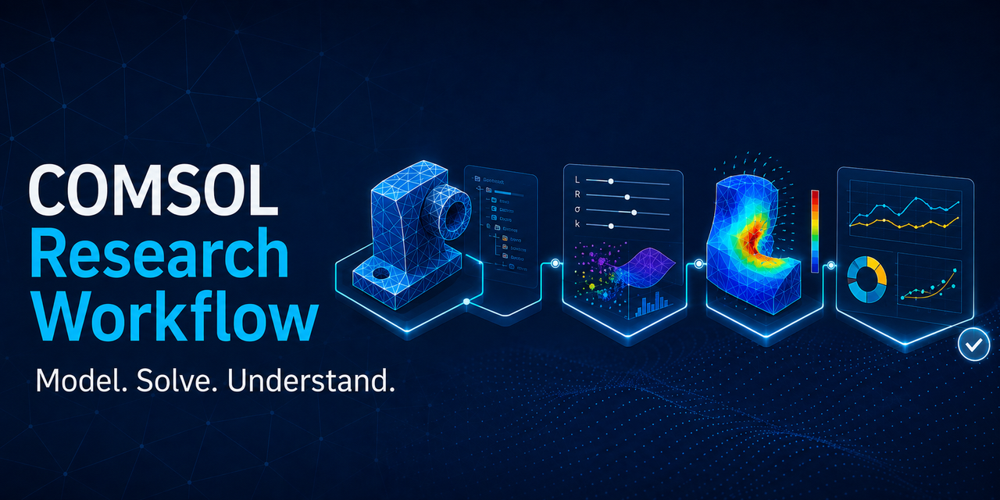
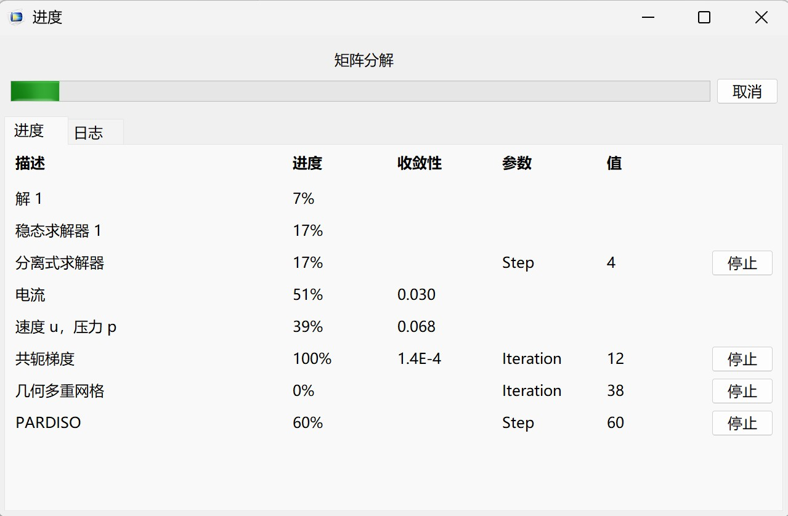
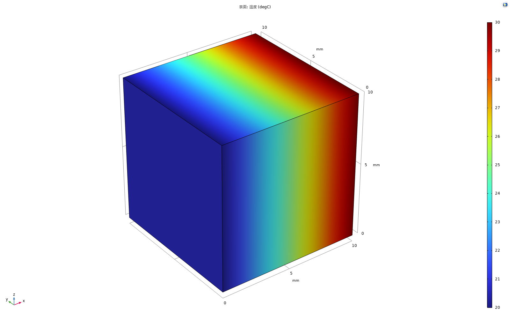

# COMSOL Research Workflow

**Model. Solve. Understand.**



Operate COMSOL from natural language through one skill and two executable backends. Choose Java or MCP once, then let the agent build or modify models, diagnose failures, solve, extract results, and develop physical insight. This is not a read-only workflow guide.

[中文](README.md) · [Skill instructions](SKILL.md) · [Java batch](references/java-batch.md) · [MCP interactive](references/mcp-interactive.md) · [Physics review](references/physics-review.md)

## What it solves

COMSOL agents often fail in one of two ways: they issue API commands without understanding the research question, or they impose so much process that routine modeling barely moves. This skill focuses on useful progress:

- translate a research question into a computable model task;
- inspect and modify existing MPH, Java/Method, or MCP work;
- diagnose geometry, physics, selections, studies, solvers, and expressions;
- run tests and sweeps, export data, and produce scientific figures;
- deliver a directly viewable MPH with the full model tree, current solution, and result tree;
- recover from connection, compile, model-tree, solver, save, and postprocessing failures without unnecessary reruns;
- select an installed COMSOL version explicitly and handle MPH/API compatibility deliberately;
- scale validation to the consequence of the result.

The default loop is:

```text
Understand → Model → Run → Inspect → Iterate → Deliver
```

Full evidence gates are reserved for formal reproduction, promotion, disputed results, and publication-critical outputs.

## Troubleshooting and version compatibility

The bundled [troubleshooting guide](references/troubleshooting-efficiency.md) routes by the first failed layer and resumes from the latest usable MPH whenever possible. The [version guide](references/version-compatibility.md) covers multiple installations, MPH file direction, Java API changes, and controlled migration.

Development primarily uses COMSOL 6.3: the Java runner has been checked at Doctor/Compile level, and the lightweight MCP GUI case was run end to end on 6.3. The longer heat-sink record remains an accurately labelled 6.2 run. Other releases can be selected with `COMSOL_VERSION` or `COMSOL_ROOT`, but individual physics features and versions are not universally certified.

## Choose a backend on first use

| Mode | How it operates COMSOL | Best for |
|---|---|---|
| Java | the agent writes or edits Java API source and calls the bundled runner, `comsolcompile`, and `comsolbatch`; interactive runs enable COMSOL's native progress window by default | formal sweeps, long runs, reproducibility |
| MCP | the agent controls a live model and can open COMSOL Desktop on the same server and export previews | exploration, diagnosis, model trees, native GUI viewing |

The skill asks once when the first real COMSOL operation begins. After selection it uses the chosen backend instead of returning generic instructions. Users can switch modes later in natural language.

## Two modes, one complete MPH

Java and MCP are two ways to operate COMSOL, not two different delivery standards. Whenever a task creates, modifies, or solves a model, the default deliverable is a directly openable `.mph`, not merely source code, a live session, CSV files, or images.

The saved model retains the task's parameters and units, geometry, named selections, materials, physics and boundary conditions, mesh, study/solver configuration, current solution, datasets, plot groups and plot features, derived values, and tables. The final save happens after the result tree is built; postprocessing changes trigger another save. Formal results are also verified by reopening the saved MPH read-only.

When external CAD, interpolation data, or user functions cannot be embedded, the skill packages them beside the MPH, uses stable relative paths where possible, and declares the dependencies instead of claiming the file is self-contained.

## Quick start

Actual solves require a licensed local COMSOL Multiphysics installation. Java mode needs a terminal-capable agent; MCP mode needs the bundled connector to be installed and added to the client once.

Clone the repository or download the release ZIP, then place the complete `comsol-research-workflow/` directory in your agent's skills folder. Do not copy only `SKILL.md`. Invoke it in a COMSOL task:

```text
Use $comsol-research-workflow to operate COMSOL for me in natural language.
```

The agent then offers Java mode or MCP mode. Java installation check:

```powershell
pwsh -File scripts/java-mode.ps1 -Stage Doctor -ComsolRoot "<COMSOL installation>"
```

First-time MCP backend installation:

```powershell
pwsh -File scripts/install-mcp.ps1
```

Java Run enables COMSOL's official `ModelUtil.showProgress(true)` window in the isolated runtime copy; it does not replace it with a custom look-alike or modify the user's source. Headless jobs can explicitly use `-NoProgressWindow` and retain the batch log. MCP visualization uses COMSOL Desktop connected to the same server rather than pretending that MCP itself is a GUI.



The original `gui_quickstart_3d` case was run through real MCP stdio on COMSOL 6.3 on 2026-09-09. It builds and solves a small 3D model, creates a Results tree, exports the image below, and saves a solved MPH. The `heat_sink_3d` example provides the longer mesh/stationary/transient validation recorded on COMSOL 6.2.



See the [validation record](mcp_backend/examples/validation/README.md).

For formal reproduction or promotion, validate a run directory without opening COMSOL:

```bash
python scripts/validate_run_evidence.py /absolute/path/to/runs/<run_id>
```

The validator checks confinement, file presence, minimum sizes, SHA-256 hashes, artifact roles, and stage evidence. It deliberately does not claim that the model physics is valid.

## Three levels of rigor

| Level | Typical work | Default checks |
|---|---|---|
| Working | modeling, debugging, parameter tests, plotting | current solution, variables, units, main trends |
| Formal reproduction | long runs, formal sweeps, thesis results | stable entrypoint, case identity, logs, raw exports |
| Acceptance/promotion | handoff, disputed results, formal archive | full evidence gates, manifest, hashes, and physics QA |

Routine tasks stay fast; formal results can still be made reproducible when that effort is justified.

## Non-goals

- Bundling COMSOL, commercial licenses, manuals, or official models;
- assuming a specific MCP server, port, or tool name;
- presenting arbitrary code execution as a sandbox;
- promising identical results across COMSOL versions;
- replacing domain physics review with process compliance.

## Status

`v1.1.0`: COMSOL's native Java progress window by default, a COMSOL 6.3 MCP GUI quickstart, symptom-driven recovery, and explicit cross-version handling.

COMSOL Multiphysics is commercial software and a trademark of COMSOL AB. This independent project is not affiliated with or endorsed by COMSOL AB.
