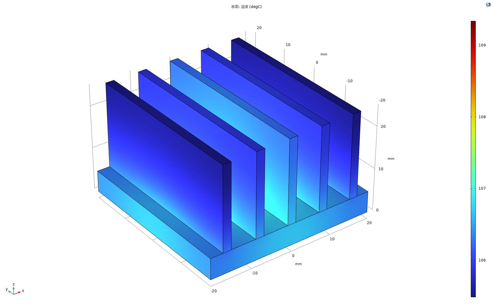
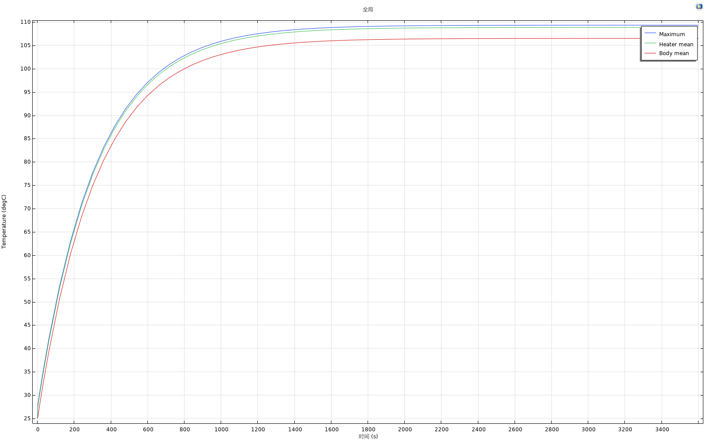

# 发布验证记录

验证日期：2026-09-05。COMSOL 6.2.0.290，Python 3.12，MPh 1.4.0，MCP Python SDK 1.29.1，Windows。

## 原创三维散热器

从本包独立 Python 案例重新建立几何、材料和物理场，运行 hmax=3、2、1.3 mm 三组网格，再运行 0–3600 s 瞬态。七项检查全部通过。

| 项目 | 实测值 |
| --- | ---: |
| 稳态最高温 | 109.341993 °C |
| 热源面平均温度 | 108.858896 °C |
| 输入 / 散出功率 | 10.000000 / 9.999996 W |
| 相对热量不平衡 | 3.78e-7 |
| 最后两级网格最高温差 | 0.000419 K |
| 最细级网格统计单元数 | 106,614 |
| 3600 s 最高温 | 109.343372 °C |
| 初始最高温相对 25 °C 的偏差 | 0.003511 K |

完整数据见 [heat_sink_3d.json](heat_sink_3d.json)、[mesh_convergence.csv](mesh_convergence.csv)、[warmup.csv](warmup.csv)。程序实现、假设与验收阈值见 [验证规则](../../docs/validation.md)。





完整求解后补充了模型唯一名称和保存后恢复名称的修复。该改动不改变方程；在新的真实 COMSOL 模型上分别验证 MPH 检查点、最终 MPH、Java 保存后保持同一名称。原生 Java 导出文件生成成功，但未在独立 Java 环境重放，不能称 Java 重放已验证。

## MCP 与运行时

17 项后端自动化测试通过：11 项运行时/协议检查和6 项 Windows 启动凭据生命周期检查。覆盖实际 stdio 初始化/工具调用、带 Bearer 认证的 Streamable HTTP 与 SSE 协议握手、串行执行、无全局清空的会话生命周期、关闭代码执行时拒绝调用、失败任务状态和路径边界。

启动检查通过真正运行 `start-mcp.ps1 -PrepareTokenOnly` 验证首次生成、新窗口复用、沿用旧环境 Token、冲突时保留原凭据、坏文件不自动重建、HTTP/SSE 复用同一 Token 及无效 Header 拒绝保存；测试不启动 COMSOL。复制 Header 使用本机剪贴板，此动作没有在自动化测试中读写用户剪贴板。

另外，**stdio 与带认证的 Streamable HTTP 都通过了真正连接 COMSOL 的完整链路**：创建三维模型 → API 设置并求解 → MCP 保存 → 断开 → 重连 → 重新取值。基准为 10 mm 立方体，k=1 W/(m K)，相对两面温度 293.15/303.15 K，其他面绝热；平均温度为 298.15 K，热流为 1000 W/m²。保存后模型名称保持，重连后结果可取。记录见 [stdio 实测](mcp_stdio.json)、[HTTP 实测](mcp_http.json)。这些测试使用标准 MCP Python 客户端；不同客户端仍需分别完成连接配置。

可重复运行不需要 COMSOL 许可证的自动化检查：

```powershell
python -m unittest discover -s tests -v
```

顶层发布流程另检查禁止分发的模型、凭据、私人路径和运行缓存。完整仓库符合 SKILL.md 结构校验。

## 尚未验证的范围

- 46 个官方案例：只核验本地 MPH 路径、教程与元数据；没有逐个重新求解。它们仍标记 `catalogued_not_run`。
- 不同 Agent 客户端的本机 HTTP Header、技能导入和工具刷新方式：需要按客户端实际能力配置。
- 其他 COMSOL 版本、全部模块许可证、任意多物理场组合：未进行全面测试，需在目标环境验证。
